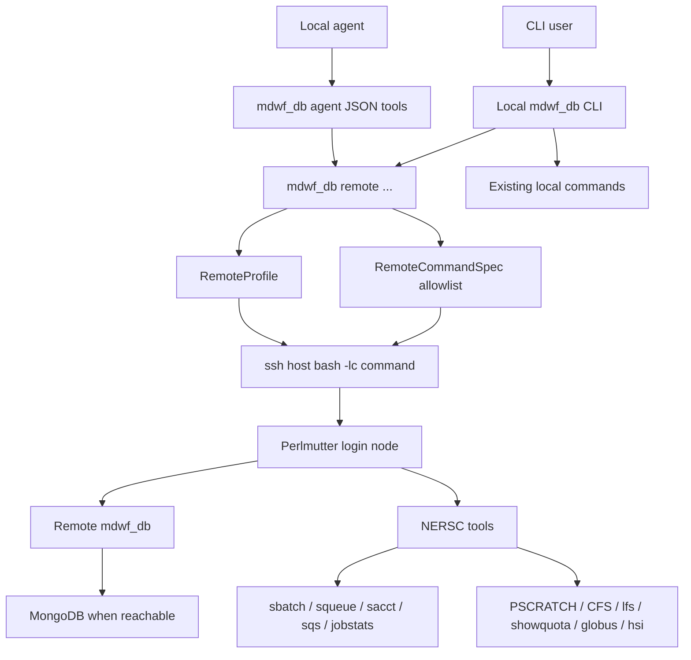
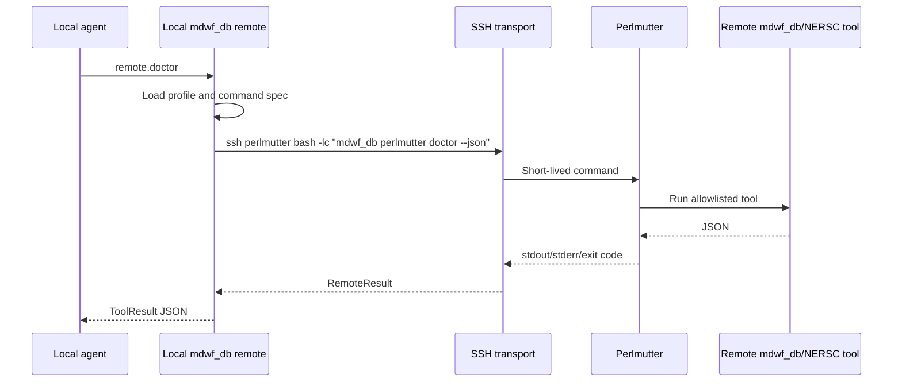

# Remote Perlmutter Operation

`mdwf_db remote ...` lets a local CLI user or local agent run short-lived,
allowlisted commands on Perlmutter over SSH. It does not require a persistent
agent process on Perlmutter login nodes, and no existing local command switches
to SSH implicitly.

## Architecture



## Profiles

Profiles live at `~/.config/mdwf_db/remote.yaml`. If no profile file exists,
`--host perlmutter` is treated as an SSH alias named `perlmutter`.

```yaml
profiles:
  perlmutter:
    host: perlmutter
    workdir: /global/cfs/cdirs/<project>/<user>/mdwf_db
    remote_mdwf_db: mdwf_db
    python_env_setup: module load python
    project_root: /global/cfs/cdirs/<project>/<user>/mdwf_db
    default_account: <nersc_account>
    default_qos: regular
```

Print a template with:

```bash
mdwf_db remote profile-template --json
```

## Command Flow



## CLI Surface

Read-oriented commands:

```bash
mdwf_db remote doctor --host perlmutter --json
mdwf_db remote monitor --host perlmutter --dry-run --json
mdwf_db remote status --host perlmutter --json
mdwf_db remote storage-plan --host perlmutter --path /pscratch/... --json
mdwf_db remote stripe-plan --host perlmutter --path /pscratch/... --json
```

Guarded commands:

```bash
mdwf_db remote submit --host perlmutter -e 1 -o mres --script job.slurm --dry-run --json
mdwf_db remote submit --host perlmutter -e 1 -o mres --script job.slurm --approve --json
mdwf_db remote sync-code --host perlmutter --remote-path /global/cfs/cdirs/... --json
mdwf_db remote sync-code --host perlmutter --remote-path /global/cfs/cdirs/... --approve --json
```

Use `--dry-run-transport` to print the exact SSH argv without connecting.

## Safety Rules

- Remote execution is opt-in under `mdwf_db remote ...`.
- Remote commands are selected from named templates. `remote run` accepts only
  safe `mdwf_db` families: doctor, monitor, status, storage plan, stripe plan,
  query, `submit --dry-run`, and `ingest --dry-run`.
- Job submission requires `--approve` unless `--dry-run` is passed.
- Sync commands plan by default and run only with `--approve`.
- Sync code/config commands exclude `config/*.env`, `*.env`, `.git/`, and
  `__pycache__/`.
- Filesystem striping changes are separated from planning and require
  `mdwf_db fs stripe-apply --force`.
